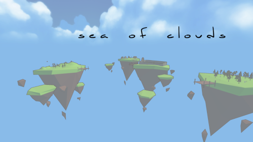
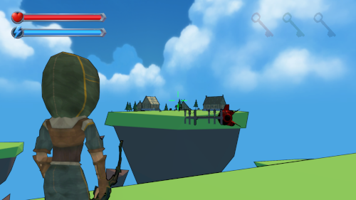
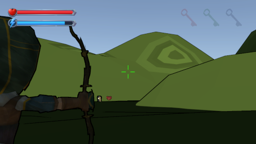
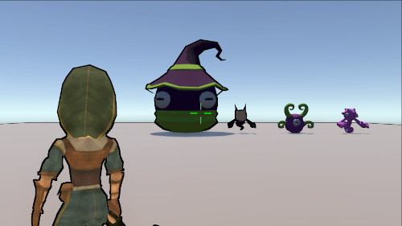
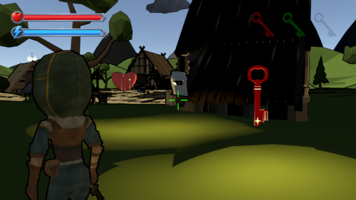
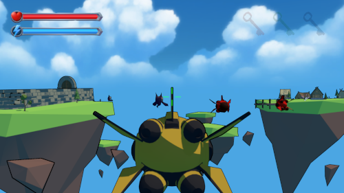
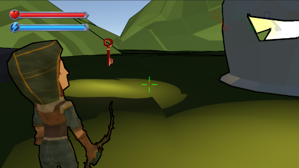
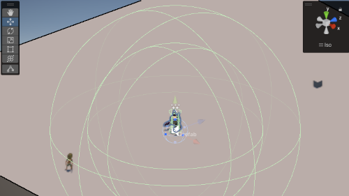
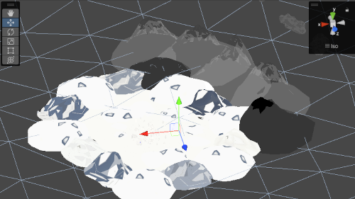

# Sea of Clouds v2.0

"Sea of Clouds" es el nombre de mi prototipo para la tercera Práctica de Evaluación Continua (PEC3) y para la Práctica Final (FP) de la asignatura Programación de Videojuegos 3D del Máster Universitario en Diseño y Programación de Videojuegos de la UOC.

El objetivo de la práctica era desarrollar un juego de plataformas en tercera persona utilizando los conocimientos adquiridos en el estudio del tercer módulo de la asignatura y realizando investigación por cuenta propia. La práctica final, además, requería ampliar el juego añadiendo mejoras y nuevas características.

## Novedades de la práctica final

Como la práctica final es una extensión de la práctica anterior, a continuación se detallan los cambios y mejoras que se han llevado a cabo para poder determinar de manera fácil las diferencias entre ambas:

- Se ha añadido un submenú de opciones y una pantalla de créditos al menú principal
- Se ha rehecho completamente la escena de juego
- Se ha añadido un vehículo controlable por el jugador
- Se ha añadido vehículos con movimiento autónomo
- Se ha añadido un nuevo comportamiento para todos los tipos de personaje que hace que exploten si son arrollados por un vehículo
- Se ha corregido los errores detectados en la práctica anterior

La práctica también ha servido para corregir los errores detectados en la práctica anterior:

- Los sistemas de partículas asociados a los personajes y objetos ya no se están renderizando por detrás de los elementos del terreno.
- Las olas del agua que rodea la isla ya no se reflejan en los personajes y enemigos repartidos por la escena.
- Todos los personajes están completamente sonorizados.
- No es posible caer a las zonas de muerte.

Además, al final se ha optado por prescindir de la munición y de los diferentes tipos de armas, debido principalmente a la falta de tiempo, pero también porque el diseño del mundo ludoficcional no lo ha contemplado desde el principio y su inclusión hubiera sido forzada. En cualquier caso, tanto el cambio de arma como la gestión de la munición son conceptos que se han aplicado anteriormente en otras prácticas.

Tampoco se ha aplicado el sistema de control de tráfico por motivos similares, dado que la existencia de semáforos u otras señales de tráfico no acaba de encajar con la atmósfera del juego.

## Vídeo explicativo (PF)

## Vídeo explicativo (PEC3)

## Versión de Unity

La versión de Unity utilizada para el desarrollo de la práctica es la <strong>2021.3.19f1 LTS</strong>.

El orden de las escenas está definido en los builds settings del proyecto, siendo Assets/Scenes/Opening.scene la primera escena que debe cargarse.

## Argumento

La isla de Gada es un lugar tranquilo y pacífico en el que sus habitantes viven en una armonía casi perfecta, condicionada únicamente por una norma impuesta milenios atrás: nadie puede abandonar la isla.

Sin embargo, las noticias de una amenaza que está devorando el mundo exterior han llegado a Gada. El Inmortal, una criatura encerrada por los dioses, ha despertado y sus legiones están arrasando el mar de nubes.

Temerosos de que la destrucción llegue a Gada, los ancianos de la aldea han decidido enviar a una joven guerrera a eliminar a buscar la guarida del Inmortal y acabar con él.

## Cómo jugar

El objetivo del juego es conseguir tres llaves mientras se esquiva a hordas de monstruos. Una vez conseguidas las tres llaves, aparece un enemigo mayor cuya derrota es el objetivo final del juego.

El control se lleva a cabo mediante teclado y ratón, aunque también está preparado para ser compatible con gamepad:

- Las letras <strong>WASD</strong> mueven al personaje.
- El <strong>Espacio</strong> hace que el personaje salte.
- La tecla <strong>Mayúsculas izquierda</strong> sirve para que el personaje esprinte.
- El <strong>botón izquierdo</strong> del ratón dispara el arco.
- El <strong>botón central</strong> del ratón realiza un ataque cuerpo a cuerpo.
- La tecla <strong>E</strong> sirve para entrar y salir del vehículo.
- La tecla Escape sirve para pausar el juego y abrir el menú de pausa.

## Desarrollo

De cara a completar el desarrollo de ambas prácticas, se han llevado a cabo las siguientes tareas obligatorias y opcionales, además de incluir algunos extras que se han ido añadiendo a lo largo del desarrollo.

### Tareas obligatorias

- [x] Se ha creado un escenario que dispone de zonas urbanas y vegetales.
- [x] El personaje dispone de un arma a distancia que le permite disparar hacia delante.
- [x] El personaje está completamente animado.
- [x] La salud y la armadura se muestran constantemente en el HUD, pero no la munición.
- [x] Los enemigos pasean por la ciudad y atacan al enemigo cuando está cerca.
- [x] Los enemigos están completamente animados.
- [x] Se dispara un sistema de partículas cuando un personaje (jugador o no) recibe daño o muere.
- [x] Hay objetos de salud y armadura repartidos por el escenario, pero no de munición.
- [x] El juego dispone de una pantalla de juego terminado que permite reiniciar la partida.
- [x] Los enemigos se mueven entre puntos aleatorios y corren hacia el jugador al detectarlo.
- [x] Hay personajes de carácter neutral paseando por el escenario.
- [x] Los personajes de carácter neutral huyen de los enemigos.
- [x] Se ha creado un menú principal que, además de empezar la partida, permite configurar varios parámetros del juego: volumen general, velocidad del juego y dificultad del juego.
- [x] Hay vehículos que se mueven por el escenario.
- [x] El jugador puede entrar en los vehículos y desplazarse con ellos.

### Tareas opcionales

- [x] El juego dispone de al menos un puzle que requiere saltar para progresar.
- [ ] Se han añadido diferentes tipos de armas.
- [ ] Las armas están repartidas por el escenario.
- [x] El juego está totalmente sonificado.
- [x] Se han añadido diferentes tipos de enemigos.
- [x] Es posible apuntar al disparar.
- [x] El juego dispone de al menos un puzle que requiere obtener llaves para progresar.
- [x] El jugador tiene un arma cuerpo a cuerpo.
- [x] Los enemigos pueden dejar objetos al morir.
- [x] Los enemigos aparecen en varias fuentes del escenario de manera incremental.
- [x] Se ha utilizado el componente animation rigging para que el personaje mire hacia los objetos cercanos.
- [x] Se ha implementado la iluminación global.
- [x] Los personajes de carácter neutral se convierten en enemigos al morir a manos de un enemigo.
- [ ] Hay un sistema de control del tráfico que limita el movimiento autónomo de los vehículos.
- [x] Los NPC y los enemigos explotan si el jugador los atropella a gran velocidad.

## Características principales

A continuación se detallan las características más importantes del desarrollo de la práctica.

### La escena de juego (PEC3 y PF)

La escena del juego se ha rehecho completamente para la práctica final. Ahora, el escenario consiste en cuatro islas flotantes en un mar de nubes.

- La isla principal, Gada, situada al suroeste, consiste en una aldea con varios edificios y zonas vegetales. Hay varios NPC repartidos por ella y enemigos que empiezan a aparecer la primera vez que se vuelve a ella. Uno de los enemigos que aparece posee una de las llaves.
- La isla del sureste, Stria, contiene un templo en el que se encuentra una de las llaves. Para llegar a ella, es necesario resolver un puzle que consiste en abrir varias puertas pisando diferentes interruptores y llegado a una zona inaccesible mediante plataformas.
- La isla del norte, Voni, contiene un bosque en el que se encuentra la última de las llaves. Hay varios enemigos fuertes repartidos por ella que conviene evitar.
- Finalmente, la isla del centro, Vanglasaar, contiene una estructura en la que se encuentra el jefe final del juego. Para llegar a él, es necesario haber recogido previamente las tres llaves.

### Apuntado, disparo y ataque cuerpo a cuerpo (PEC3)

Para poder disparar el arco, es necesario cargarlo primero. Al hacerlo, el juego bloquea el movimiento del jugador para que no pueda girar con las flechas (sólo desplazarse lateralmente) y enfoca la visión utilizando una segunda cámara. Además, permite apuntar de manera libre a cualquier punto de la escena.

### El HUD (PEC3 y PF)

Como en el caso de la PEC2, la interfaz de usuario muestra en todo momento la salud y el escudo del jugador, así como las llaves que ha conseguido y la munición restante del arma actualmente equipada. También muestra la cruceta y los mensajes enviados por el juego.

### Tipos de personaje (PEC3)

A efectos de gestionar de manera transversal las características comunes entre jugador, enemigos y NPC, se ha creado una clase maestra que contiene las propiedades y métodos compartidos y que se apoya en una máquina de estados para manejar el tipo del jugador. Esta aproximación permite, entre otras cosas, poder cambiar fácilmente de tipo a un personaje y se implementa <strong>cuando un NPC neutral o aliado se convierte en enemigo al morir</strong>. E incluso permitiría al jugador controlar a un NPC o a un enemigo, así como a cualquier otra entidad a la que se extienda la clase.

Se han incluido los tipos siguientes:

- <strong>Player.</strong> En este estado, se desactivan las automatizaciones y se activan el character controller y el resto de componentes necesarios para poder jugar.
- <strong>Enemy</strong>. En este estado, el personaje deambula por la escena y ataca al jugador y a los NPC neutrales y aliados cuando pasan cerca.
- <strong>Boss</strong>. En este estado, el personaje se comporta igual que un enemigo, pero añade la lógica de finalización del juego al derrotarlo.
  <strong>Neutral</strong>. En este estado, el personaje deambula por la escena y huye cuando un enemigo pasa cerca.
- <strong>Ally</strong>. En este estado, el personaje deambula por la escena y ataca a los enemigos que pasan cerca.

En el caso de los enemigos y los NPC (neutrales y aliados) se han añadido varios tipos con modelos y características diferentes (velocidad, daño, resistencia, etc.).

### Objetos y llaves (PEC3)

Como en la práctica anterior, el juego incluye tanto objetos de curación como llaves repartidas por el escenario o dejadas por los enemigos al morir.

;

### Vehículos (PF)

La principal novedad añadida en la práctica final es la inclusión de vehículos. En concreto, se han añadido una nave que permite al jugador desplazarse entre las islas flotantes y que tiene dos estados posibles, ya que, como en el caso de los jugadores, se apoya en una máquina de estados para gestionar su comportamiento y permite cambiar de tipo en tiempo de ejecución:

- <strong>Human.</strong> En este estado, el jugador puede controlar la nave y atropellar a los enemigos flotantes.
- <strong>AI.</strong> En este estado, la nave se desplaza de manera autónoma en rutas predeterminadas.

El jugador sólo puede subir y bajar del vehículo desde el muelle de cada isla.

### Animaciones y rigging (PEC3)

Todos los personajes están completamente disponen de animaciones para todas las posibles combinaciones, aunque no las utilicen, precisamente por la posibilidad de que cualquiera de ellos cambie de tipo. Además, se usan capas y animation events para poder controlar de manera fácil desde el código los momentos en los que se produce algún factor de interés en la reproducción de la animación.

También se ha implementado el animation rigging para el jugador, principalmente para hacer que tanto la cabeza como el torso del personaje miren suavemente hacia los objetos que tienen cerca, pero también para asegurar que el arco mira en todo momento a la posición correcta cuando se está apuntando.

### Sistemas de partículas (PEC3)

Se han implementado partículas para un gran número de acciones: al ser golpeado, al morir, al recuperar salud, al convertirse en enemigo, etc.

### Inteligencia artificial (PEC3)

Para implementar los objetivos relacionados con la inteligencia artificial, se utiliza una mezcla de NavMesh y de detección de colisiones. Todos los personajes disponen de tres maneras de detectar colisiones: con el collider incorporado al modelo a través del player controller o del capsule collider, con un trigger en un una esfera con un radio de cuatro metros (esfera interna) y por otra con un radio de siete metros (esfera externa). Además, disponen del componente NavMeshAgent para poder navegar por el terreno de manera autómoma.

Teniendo eso en cuenta, el flujo de un personaje normalmente es:

- En su estado inicial, a falta de objetivos, el personaje deambula por el escenario desplazándose entre puntos aleatorios con NavMesh.
- Cuando otro personaje entra en su esfera interna, lo añade a una lista de objetivos que utiliza para escapar (NPC neutral) o para saber a qué atacar (NPC Aliado, Enemigo y Enemigo final).
- Además, si el personaje es atacado por cualquier otro personaje, lo define directamente como objetivo forzado, independientemente de si está o no dentro del rango de detección.
- Mientras la lista contiene objetivos, el personaje comprueba qué personaje es el que está más cerca y en base a ello fija un punto de origen del cuál huir (NPC neutral) o fija un punto de destino para atacar (NPC Aliado, Enemigo y Enemigo final).
- Si el personaje alcanza a su objetivo, ataca siempre y cuando no exista una determinada distancia entre ambos.
- Cuando un objetivo sale de la esfera externa, el personaje lo elimina de la lista de personajes y deja de perseguirlo.
- Si la lista de objetivos se vacía, el personaje vuelve a deambular por el escenario.

### Iluminación global (PEC3)

Finalmente, se ha hecho uso de la iluminación global y el baking para optimizar el uso de la iluminación en la escena de juego y mejorar el rendimiento general.

## Créditos

### Paquetes completos

- "Monsters SFX Vol.2" - Atelier Magicae [itch.io] - https://ateliermagicae.itch.io/monsters-sfx-vol2
- "RPG Character Pack" - Quaternius - https://quaternius.com/packs/rpgcharacters.html
- "RPG Poly Pack - Lite" - Gigle [Unity Assets Store] - https://assetstore.unity.com/packages/3d/environments/landscapes/rpg-poly-pack-lite-148410
- "RPG UI elements. Strategy UI elements. Medieval game UI elements. MMO and RTS game UI elements. UI elements GUI kit" - arcaciastudios [itch.io] - https://imp2113sar.itch.io/rpg-game-ui-elements-strategy-game-ui-elements-medieval-game-ui-elements-mmo
- "Starter Assets - First Person Character Controller - URP" - Unity Technologies - https://assetstore.unity.com/packages/essentials/starter-assets-first-person-character-controller-urp-196525
- "Starter Assets - Third Person Character Controller" - Unity Technologies - https://assetstore.unity.com/packages/essentials/starter-assets-third-person-character-controller-196526
- "Ultimate Monsters" - Quaternius - https://quaternius.com/packs/ultimatemonsters.html
- "Ultimate RPG Pack" - Quaternius - https://quaternius.com/packs/ultimaterpg.html
- "Ultimate Spaces Kit" - Quaternius [Unity Assets Store] - https://quaternius.com/packs/ultimatespacekit.html
- "Voices - Essentials" - Nox_Sound [Unity Asset Store] - https://assetstore.unity.com/packages/audio/sound-fx/voices/voices-essentials-214441

### Fuentes

- "La jefa" - Lauren Ashpole [DaFont] - https://www.dafont.com/es/la-jefa.font
- "Wagstaf" - Storytype Studio [DaFont] - https://www.dafont.com/es/wagstaf.font

### Shaders

- "OToon - URP Toon Shading" - Eric Hu [Unity Asset Store] - https://assetstore.unity.com/packages/vfx/shaders/otoon-urp-toon-shading-216102
- "URPToonShading" - Léo Chaumartin [GitHub] - https://github.com/lchaumartin/URPToonShading

### Música

- "Heroism" - Edward J. Blakeley [OpenGameArt] - https://opengameart.org/content/heroism
- "Meloncholy Town" - VWolfdog [OpenGameArt] https://opengameart.org/content/meloncholy-town

### Sonidos

- "090035_Splat!" - Pixabay - https://pixabay.com/es/sound-effects/090035-splatwav-91604/
- "Arrow Impact" - Pixabay - https://pixabay.com/es/sound-effects/arrow-impact-87260/
- "Bow Loading" - Pixabay - https://pixabay.com/es/sound-effects/bow-loading-38752/
- "Demonic Whisper" - Pixabay - https://pixabay.com/es/sound-effects/demonic-whisper-100425/
- "Male Scream in Fear" - UNIVERSFIELD [Pixabay] - https://pixabay.com/es/sound-effects/male-scream-in-fear-123079/

### Otros assets

- "Dock Wide" - Quaternius [Poly.Pizza] - https://poly.pizza/m/XndOrGa7rN

## Referencias

### C# - General

- "Whats the most concise way to pick a random element by weight in c#?" - Eric Yin [StackOverflow] - https://stackoverflow.com/questions/9141594/whats-the-most-concise-way-to-pick-a-random-element-by-weight-in-c

### Unity - General

- "Awesome Third Person Shooter Controller! (Unity Tutorial)" - Code Monkey [YouTube] - https://www.youtube.com/watch?v=FbM4CkqtOuA
- "How to get Mouse Position in 3D and 2D! (Unity Tutorial)" - Code Monkey [YouTube] - https://www.youtube.com/watch?v=0jTPKz3ga4w
- "Starter Asset Prefab jumps infinitely" - ANNOProfi [Unity Forums] - https://forum.unity.com/threads/starter-asset-prefab-jumps-infinitely.1233067/

### Animaciones - General

- "Animation events on imported clips" - Unity Documentation - https://docs.unity3d.com/560/Documentation/Manual/AnimationEventsOnImportedClips.html
- "Animations with Layers in Unity3D - Unity Devs WATCH THIS" - Jason Weimann - https://www.youtube.com/watch?v=Qwy3rEDXqxA
- "Extract 1 animation from an FBX" - dbonejones [Unity Forums] - https://forum.unity.com/threads/extract-1-animation-from-an-fbx.164509/
- "How to Add Those Animations to Unity - Beginner Unity Tutorial (FBX)" - Smart Penguins [YouTube] - https://www.youtube.com/watch?v=Q2h2X_mtjrw

### Animaciones - Interrupción

- "Animator Transition Interrupt Sources, Explained | Unity Tutorial" - LlamAcademy [YouTube] - https://www.youtube.com/watch?v=77dWGDFqcps
- "Wait, I’ve changed my mind! State Machine Transition interruptions" - Catherine Proulx [Unity Blog] - https://blog.unity.com/technology/wait-ive-changed-my-mind-state-machine-transition-interruptions

### Animaciones - Rigging

-"Generating rig at runtime" - danUnity [Unity Forums] - https://forum.unity.com/threads/generating-rig-at-runtime.935090/
- "How to use the Animation Rigging System for weapons?" - Hannibal_Leo [Unity Forums] - https://forum.unity.com/threads/how-to-use-the-animation-rigging-system-for-weapons.749132/
- "MultiAimConstraint - Changing Source Via Script?" - TragicallyCanadian [Unity Forums] - https://forum.unity.com/threads/multiaimconstraint-changing-source-via-script.1128317/
- "PERFECT Weapon Aiming! (IK, Unity Tutorial Third Person Shooter)" - Code Monkey [YouTube] - https://www.youtube.com/watch?v=luBBz5oeR4Q
- "Unity 3rd Person - Animation Rigging Package for head look" - Bliz Studio [YouTube] - https://www.youtube.com/watch?v=q7aF8l_xndE

### Cinemachine

- "Creating a Third Person Camera using Cinemachine in Unity! (Tutorial)" - Unity [YouTube] - https://www.youtube.com/watch?v=537B1kJp9YQ

### Iluminación

- "Baked Global illumination in Unity Tutorial" - MR3D-Dev [YouTube] - https://www.youtube.com/watch?v=iByXt2idyuU
- "Configuring Lightmaps" - Unity Leard - https://learn.unity.com/tutorial/configuring-lightmaps
- "How to build Lightmaps in Unity 2020.1 | Tutorial" - Unity [YouTube] - https://www.youtube.com/watch?v=KJ4fl-KBDR8

### NavMesh

- "Random "Wander" AI using NavMesh" - CnC96 [Unity Forums] - https://forum.unity.com/threads/solved-random-wander-ai-using-navmesh.327950/
- "How to Program Enemy Running Away Behavior in Unity" - Eric Dustin [GameDevMasterful] - https://gamedevmasterful.com/blog/how-to-program-enemy-running-away-behavior-in-unity/
- "Wandering AI Tutorial" - Aron Granberg - https://arongranberg.com/astar/docs/wander.html

### Shaders

- "Cel Shader with Outline in Unity" - Linden Reid - https://lindenreidblog.com/2017/12/19/cel-shader-with-outline-in-unity/
- "Toon Outlines in Unity URP, Shader Graph Using Sobel Edge Detection!  2020.3 | Game Dev Tutorial" - Ned Makes Games [YouTube] - https://www.youtube.com/watch?v=RMt6DcaMxcE
- "Toon Shading - The EASIEST WAY! Unity3D URP Shadergraph Tutorial" - Léo Chaumartin [YouTube] - https://www.youtube.com/watch?v=Rn_yJ516dVQ